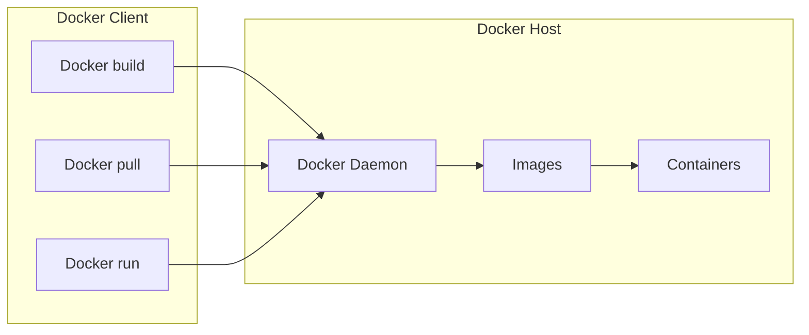

# Docker Overview
Docker is an open platform for developing, shipping, and running applications. Docker enables you to seperate your applications from your infrastructure so you can deliver software quickly.

# Docker Platform
Docker provides the ability to package and run an applications in a loosely isolated environment called a container. Docker provides tooling and a platform to manage the lifecycle of your containers:
* Develop your application and its supporting components using container.
* The container becomes the unit for distributing and testing your application.
* Depoly your applications into your production environment, as a container or archestrated service.

# What can I use Docker for?

### Fast, consistent delivery of your applications

### Responsive deployment and scaling

### Running more workloads on the same hardware

# Docker architecture
The Docker daemon (dockerd) listens for Docker API requests and manages Docker objects such as images, containers, network, and volumes. A daemon can also communicate with other demons to manage Docker services.


## The Docker client

The Docker client (docker) is the primary way that many Docker users interact with Docker. When you use commands such as `docker run` , the client sends these commands to `dockerd`.The `docker` command uses the Docker API.


## Docker registries

A Docker *registry* stores Docker images. Docker Hub is a public registry that anyone can use, and Docker is configured to look for images on Docker Hub by default.

When you use the `docker pull` or `docker run` commands, the required images are pulled from your configured degistry. When you use the `docker push` command, your image is pushed to your configured registry.

## Docker objects 
When you use Docker, you are creating and using images, containers, networks, volumes, plugins, and other objects. 

### IMAGES
An *image* is a read-only template with instructions for creating a Docker container. Often, an image is *based on* another image, with some additional customization. 
You might create your own images or you might only use those created by others and published in a registry. 
### CONTAINERS
A container is a runnable instance of an image. You can create, start, stop, move, or delete a container using the Docker API or CLI. You can connect a container to one or more networks, attach storage to it, or even create a new image based on its current state. 
By default, a container is relatively well isolated from other containers and its host machine. 
#### Example `docker run` command
```
$ docker run -it ubuntu bash
```

