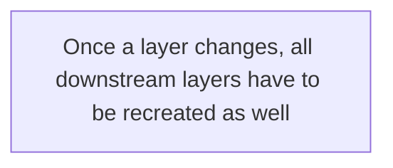

# Orientation and Setup
## Start the tutorial
Run the command:
```
docker run -d -p 80:80 docker/getting-started
```
Here are the flags:
* `-d` run the container in detached mode (in the background)
* `-p 80:80` map port 80 of the host to port 80 in the container
* `docker/getting-started` the image to use

## What is a container?
A container is simply another process on your machine that has been isolated from all other processes on the host machine. 

## What is a container image?
The custom filesystem to run a container is provided by a **container image**. Since the image contains the containers' filesystem, it must contain everything needed to run an application - all dependencies, configuration, scripts, binaries and etc. 

# Our Application
## Getting our App
For this tutorial, we have created a zip file containing the application
1. [Download the App contents](http://localhost/assets/app.zip).
2. Once extracted, use your favorite code editor to open the project.

## Building the App's Container Image
In order to build the application, we need to use a `Dockerfile`. A Dockerfile is simply a text-based script of instructions that is used to create a container image. 
1. Create a file name `Dockerfile` in the same folder as the file `package.json` with the following contents.
```
FROM	node:12-alpine
WORKDIR /app
COPY . .
RUN yarn install --production
CMD ["node", "src/index.js"]
```
2. Now build the container image using the `docker build` command. 
```
docker build -t getting -started .
```
We instructed the builder that we wanted to start from the `node:12-alpine` image. After the image was downloaded, we copied in our application and used `yarn` to install our application's dependencies. The `CMD` directive specifies the default command to run when starting a container from this image. 
Finally, the `-t` flag tags our image. Since we named this image `getting-started`, we can refere to that image when we run a container. 
The `.` at the end of the `docker build` command tells that Docker should look for `Dockerfile` in the current directory. 
## Starting an App Container
1. Start your container using the `docker run` command and specify the name of the image we just created:
```
docker run -dp 3000:3000 getting-started
```
2. Open your web browser to http://localhost:3000. 
3. Go ahead and add an item or two and see that it works as you expect.

# Updating our Application
## Updating our Source Code
1. In the `src/static/js/app.js` file, update line 56 to use the new empty text.
```
-    <p className="text-center">No items yet! Add one above! </p>
+    <p className="text-center">You have no todo items yet! Add one above!</p>
```
2. Let's build our updated version of the image, using the same command we used before.
```
docker build -t getting-started .
```
3. Let's start a new container using the update code.
```
docker run -dp 3000:3000 getting-started
```
Error shows up :
```
docker: Error response from daemon: driver failed programming external connectivity on endpoint reverent_babbage (eebe14228f8fd44f7f0c1beadeee1a9ee614f0a3e925d57aa2c34e28f3af847a): Bind for 0.0.0.0:3000 failed: port is already allocated.
```
We aren't able to start the new container because our old container is still running. 
## Replacing our Old Container
To move a container, it first needs to be stopped. 
### Removing a container using the CLI
1. Get the ID of the container by using the `docker ps` command.
```
docker ps
```
2. Use the `docker stop` command to stop the container. 
```
# Swap out <the-container-id> with the ID from docker ps
docker stop <the-container-id>
```
3. Once the container has stopped, you can remove it by using the `docker rm` command.
```
docker rm <the-container-id>
```
### Starting our updated app container
1. Now, start your updated app.
```
docker run -dp 3000:3000 getting-started
```
2. Refresh your brower on http://localhost:3000 and you should see your updated help text. 

# Sharing Our Application
## Create a Repo
The push an image, we first need to create a repo on Docker Hub. 
1. Go to [Docker Hub](https://hub.docker.com/) and log in if you need to.
2. Click the **Create Repository** button.
3. For the repo name, use `getting-started`. Make sure the Visbility is `public`.
4. Click the **Create** button!

If you look on the right-side of the page, you'll see a section named **Docker commands**. 

## Pusing our Image
1. Try running the push command you see on Docker Hub. 
```
docker push hongsuva/getting-started
The push refers to repository [docker.io/hongsuva/getting-started]
An image does not exist locally with the tag: hongsuva/getting-started
```
Why? The push command was looking for an image name docker/getting-started, but didn't find one. If you run `docker image ls`, you won't see one either.
To fix this, we need to "tag" our existing image we've built to give it another name. 

2. Login to the Docker Hub using the command `docker login -u YOUR-USER-NAME`. 	
3. Use the `docker tag` command to give the `getting-started` image a new name. 
```
docker tag getting-started YOUR-USER-NAME/getting-started
```
4. Now try to push command again. 
```
docker push YOUR-USER-NAME/getting-started
```
## Running our Image on a New Instance
1. Open your browser to [Play with Docker](http://play-with-docker.com/). 
2. Log in with your Docker Hub account.
3. Click on the "+ADD NEW INSTANCE" link in the left side bar. 

	1. In the terminal, start your pushed app.
	```
	docker run -dp 3000:3000 YOUR-USER-NAME/getting-started
	```
	2. Click on the 3000 badge when it comes up and yousee the app with your modifications. 

# Persisting our DB
## The Container's Filesystem
### Seeing this in Practice
1. Start `ubuntu` container that will create a file named `/data.txt` with a random number between 1 and 10000.
```
docker run -d ubuntu bash -c "shuf -i 1-10000 -n 1 -o /data.txt && tail -f /dev/null"
```
2. Validate we can see the output by `exec`ing into the container. 
```
docker exec <container-id> cat /data.txt
```
3. Let's start another `ubuntu` container and we'll see we don't have the same file.
```
docker run -it ubuntu ls /
```
4. Go ahead and remove the first container using the `docker rm -f` command.

## Container Volumes
Volumes provide the ability to connect specific filesystem paths of the container back to the host machine. 
## Persisting our Todo Data
By default, the todo ap stores its data in a SLite Database at `/etc/todos/todo.db/`. 
By creating a volume and attaching it to the directory the data is stored in, we can persist the data. As container writes to the `todo.db`  file, it will be persisited to the host in the volume. 
We are going to use a **named volume** , one of two main types of volumes, which is a bucket of data. 
1. Creae volume by using `docker volume create` command.
```
docker volume create todo-db
```
2. Stop the todo app container once again in the Dashboard (or with `docker rm -f <id>`), as it is still running without using the persistent volume. 
3. Start the todo app container, but add the `-v` flag to specify a volume mount. 
```
docker run -dp 3000:3000 -v todo-db:/etc/todos getting-started
```
4. Open the app and add a few items to your todo list.
5. Remove the container for the todo app. Use the `docker ps` to get the ID and the `docker rm -f <id>` to remove it. 
6. Start a new conainer using the same command from above.
7. Open the app. You should see your items still in your list!

## Diving into our Volume
You can use the `docker volume inspect` command to find where Docker actaully is storing your data.
```
docker volume inspect todo-db
[
    {
        "CreatedAt": "2021-02-05T11:20:57-06:00",
        "Driver": "local",
        "Labels": {},
        "Mountpoint": "/var/lib/docker/volumes/todo-db/_data",
        "Name": "todo-db",
        "Options": {},
        "Scope": "local"
    }
]
```
The `Mountpoint` is the acutal location on the disk where the data is stored. 

# Use bind mounts
With **bind mounts**, we control the exact mountpoint on the host. 
For Node-based applications, nodemon is a great tool to watch for file changes and then restart the application.

## Quick volume type comparisons
|  |**Named Volumes**  |**Bind Mounts**  |
|--|--|--|
|Host Location  |Docker Choose  |You control  |
|Mount Example(using `-v`) | my-volume:/user/local/data | /path/to/data:/usr/local/data|
|Populates new volume with container contents | Yes | No
Supports Volume Drivers| Yes | No
## Start a dev-mode container
To run our container to support a development workflow,
 * Mount our source code into the container
 *  Install all dependencies, including the "dev" dependencies
 * Start nodemon to watch for filesystem changes

1. Make sure you don't have any previous `getting-started` containers running.

 2. Run the following command. 
```
docker run -dp 3000:3000 -w /app -v "$(pwd):/app" node:12-alpine sh -c "yarn install && yarn run dev"
```
	

 * `-dp 3000:3000` : same as before
 * `-w/app` : set the "working directory" 
 * `-v "$(pwd):/app"` : bind mount the current directory from the host in the container into the `/app` directory
 * `node:12-alpine`: the image to use
 * `sh -c "yarn install && yarn run dev` : start a shell using `sh` (alpine doesn't have `bash`) and run `yarn install` to install *all* dependencies and then run `yarn run dev`. 
 
3. You can watch the logs using `docker logs -f <container-id>`. 
```
docker logs -f <container-id>
$ nodemon src/index.js
[nodemon] 1.19.2
[nodemon] to restart at any time, enter 'rs'
[nodemon] watching dir(s): *.*
[nodemon] starting 'node src/index.js'
Using sqlite database at /etc/todo/todo.db
Listening on port 3000
```

4. Let's make a change to the app. In the `src/static/js/app.js` file, let's change the "Add Item" button to simply say "Add"
```
-   {submitting ? 'Adding ...' : 'Add Item'}
+   {submitting ? 'Adding ...' : 'Add'}
```
5. Refresh the page. You should see the change.

## Multi container apps
We now ant to add MySQL to the application stack. In general, **each container should do one thing and do it well**. 
* There's a good chance you'd have to scale APIs and front-ends differently than databases.
* Sepearte containers let you version and update versions in isolation.
* While you may use a container for the database locally, you may want to use a manged service for the database in production. You don't want to ship your database engine with your app then.
* Running multiple processes will require a process manager, which adds complexity to container startup/shutdown

```mermaid
graph LR
	subgraph 
	id1["Todo App"] 
	id2["MySQL"]
	end 
	id1 --- id2
```

## Conatiner networking
If two containers are on the same network, they can talk to each other. If they aren't, they can't
### Start My SQL
There are two ways to put a container on a network: 1) Assign it at start or 2) connet an exisiting container.
1. Create the network
```
docker network create todo-app
```
2. Start a MySQL container and attach it to the network
```
docker run -d --network todo-app --network-alias mysql -v todo-mysql-data:/var/lib/mysql -e MYSQL_ROOT_PASSWORD=secret -e MYSQL_DATABASE=todos mysql:5.7
```
You notice we're using a volume named `todo-mysql-data` here and mounting it at `/var/lib/mysql`. However, we never ran a `docker volume create` command. Docker recognizes we want to use a named volume and creates one automatically for us.

3. To confirm we have the database up and running, connect to the database and verify it connents.
```
docker exec -it <mysql-container-id> mysql -p
```
Password: **secret**
```
mysql> SHOW DATABASES;
```
You should see output that looks like this:
```
+--------------------+
| Database           |
+--------------------+
| information_schema |
| mysql              |
| performance_schema |
| sys                |
| todos              |
+--------------------+
5 rows in set (0.00 sec)
```
## Connect to MySQL
We're going to make usre of the nicolaka/netshoot container, which ships with *a lot* of tools that are useful for troubleshooting or debugging networking issue.
1. Start a new container using the nicolaka/netshoot image. Make sure to connect it to the same network.
```
docker run -it --network todo-app nicolaka/netshoot
```
2. Inside the container, we're going to use the `dig` command. We're going to look up the IP address for the hostname `mysql`.
```
dig mysql
```
And you will get an output like this:
```
; <<>> DiG 9.16.11 <<>> mysql
;; global options: +cmd
;; Got answer:
;; ->>HEADER<<- opcode: QUERY, status: NOERROR, id: 11718
;; flags: qr rd ra; QUERY: 1, ANSWER: 1, AUTHORITY: 0, ADDITIONAL: 0

;; QUESTION SECTION:
;mysql.				IN	A

;; ANSWER SECTION:
mysql.			600	IN	A	172.18.0.2

;; Query time: 15 msec
;; SERVER: 127.0.0.11#53(127.0.0.11)
;; WHEN: Fri Feb 05 18:05:01 UTC 2021
;; MSG SIZE  rcvd: 44
```
In the "ANSWER SECTION", you will see an `A` record for `mysql` that resolves to `172.18.0.2`. 

## Run your app with MySQL
The todo app supports the setting of a few environment variables to specify MySQL connection settings. 
* `MYSQL_HOST`: the hostname for the running MySQL server
* `MYSQL_USER`: the username to use for the connection
* `MYSQL_PASSWORD`: the password to use for the connection
* `MYSQL_DB`: the database to use once connected

Let's start our dev-ready container
1. We'll specify each of the environment varaibles above, as well as connect the container to our app network.
```
 docker run -dp 3000:3000 \
   -w /app -v "$(pwd):/app" \
   --network todo-app \
   -e MYSQL_HOST=mysql \
   -e MYSQL_USER=root \
   -e MYSQL_PASSWORD=secret \
   -e MYSQL_DB=todos \
   node:12-alpine \
   sh -c "yarn install && yarn run dev"
```
2. If we look at the log for the container (`docker logs <container-id>`), we should see a message indicating it's using the mysql database.
```
 # Previous log messages omitted
 $ nodemon src/index.js
 [nodemon] 1.19.2
 [nodemon] to restart at any time, enter `rs`
 [nodemon] watching dir(s): *.*
 [nodemon] starting `node src/index.js`
 Connected to mysql db at host mysql
 Listening on port 3000
``` 
3. Open the app in your browser and add a few items to your todo list
4. Connect to the mysql database and prove that the items are being written to the database.
```
docker exec -it <mysql-container-id> mysql -p todos
```
And in the mysql shell, run the following:
```
 mysql> select * from todo_items;
 +--------------------------------------+--------------------+-----------+
 | id                                   | name               | completed |
 +--------------------------------------+--------------------+-----------+
 | c906ff08-60e6-44e6-8f49-ed56a0853e85 | Do amazing things! |         0 |
 | 2912a79e-8486-4bc3-a4c5-460793a575ab | Be awesome!        |         0 |
 +--------------------------------------+--------------------+-----------+
```
# Use Docker Compose
Docker Compose is a tool that was developed to help define and share multi-container applications. 
The *big* advantage of using Compose is you can define your application stack in a file, keep it at the root of your project repo, and easily enable someone else to contribute to your project. 

## Install Docker Compose 
You should be able to run the following and see version infomaton.
```
docker-compose version
```
## Create the Compose file
1. At the root of the app project, create a file named `docker-compose.yml`
2. In the compose file, we'll start off by defining the schema version
```
version: "3.7"
```
3. We'll define the list of services (or containers) we want to run as part of our applications
 ```
 version: "3.7"
 services:
 ```
 ## Define the app service
 We are using to define our app container.
 ```
docker run -dp 3000:3000 \
  -w /app -v "$(pwd):/app" \
  --network todo-app \
  -e MYSQL_HOST=mysql \
  -e MYSQL_USER=root \
  -e MYSQL_PASSWORD=secret \
  -e MYSQL_DB=todos \
  node:12-alpine \
  sh -c "yarn install && yarn run dev"
```


   1. First, lets define the service entry and the image for container.
	2. Typically, you will see the command close to the `image` definition
	3.  Let's migrate the `-p 3000:3000` part of the command by defining the `ports` for the service
	4. We'll migrate both the working directory (`-w /app`) and volume mapping (`-v "$(pwd):/app"`) by using `working_dir` and `volume` definitions
	5. Finally, we need to migrate environment variable defnitions using the `environment` key
```
version: "3.7"

 services:
   app:
     image: node:12-alpine
     command: sh -c "yarn install && yarn run dev"
     ports:
       - 3000:3000
     working_dir: /app
     volumes:
       - ./:/app
     environment:
       MYSQL_HOST: mysql
       MYSQL_USER: root
       MYSQL_PASSWORD: secret
       MYSQL_DB: todos
```
## Define the MySQL service
Now it's time to define my SQL service.
```
docker run -d \
  --network todo-app --network-alias mysql \
  -v todo-mysql-data:/var/lib/mysql \
  -e MYSQL_ROOT_PASSWORD=secret \
  -e MYSQL_DATABASE=todos \
  mysql:5.7
```

1. We will first define the new service and name it `mysql`.
2. Next, we'll define the volume mapping. 
3. Finally, we only need to specify the environment variables.
```
 version: "3.7"

 services:
   app:
     # The app service definition
   mysql:
     image: mysql:5.7
     volumes:
       - todo-mysql-data:/var/lib/mysql
     environment: 
       MYSQL_ROOT_PASSWORD: secret
       MYSQL_DATABASE: todos
    
 volumes:
   todo-mysql-data:
```
## Run the application stack

1. Make sure no other copies of the app/db are funning first (`docker ps` and `docker rm -f <ids>`)
2. Start up the application stack using the `docker-compose up` command. 
```
docker-compose up -d
```
When we run this, we should see output like this:
```
 Creating network "app_default" with the default driver
 Creating volume "app_todo-mysql-data" with default driver
 Creating app_app_1   ... done
 Creating app_mysql_1 ... done
```
3. Let's look at the logs using the `docker-compose logs -f` command. The `-f` flag "follows" the log, so will give you live output as its generated.
```
 mysql_1  | 2019-10-03T03:07:16.083639Z 0 [Note] mysqld: ready for connections.
 mysql_1  | Version: '5.7.27'  socket: '/var/run/mysqld/mysqld.sock'  port: 3306  MySQL Community Server (GPL)
 app_1    | Connected to mysql db at host mysql
 app_1    | Listening on port 3000
```

## Tear it all down
Simply run `docker-compose down`. 

# Image-building best pratices
## Security scanning
When you have built an image, it is good practice to scan it for security vulnerabilities using the `docker scan` command. 
For example,
```
docker scan getting-started
```
## Image layering
Using the `docker image history` command, you can see the command that was used to create each layer within an image.
1. Use `docker image history` command to see the layers in the `getting-started` image you created earlier in the tutorial.
```
docker image history getting-started
```
2. You'll notice the several of the lines are truncated. If you add tthe `--no-trunc` flag, you will get the full output.
```
docker image history --no-trunc getting-started
```

## Layer caching

Let's look at the Dockerfile we were using one more time...
```
FROM node:12-alpine
WORKDIR /app
COPY . .
RUN yarn install --production
CMD ["node", "src/index.js"]
```
Going back to the image history output, we see the each command in the Dockerfile becomes a new layer in the image. You might remember that when we made a change to the image, the yarn dependencies had to be reinstalled.
To fix this, we need to restructure our Dockerfile to help support the caching of the dependencies. For Node-based applications, those dependencies are defined in the `package.json` file. 
1.  Update the Dockerfile to copy in the `package.json` first, install dependencies, and then copy everything else in.
```
 FROM node:12-alpine
 WORKDIR /app
 COPY package.json yarn.lock ./
 RUN yarn install --production
 COPY . .
 CMD ["node", "src/index.js"]
```
2. Create a file name `.dockerignore` in the same folder as the Dockerfile with the following contents.
```
node_modules
```
`.dockerignore` files are an easy way to selectively copy only image relevant files. 
3. Build a new image using `docker build`
```
docker build -t getting-started .
```
4. Now, make a change to the `src/static/index.html` file. (like change `<title>` to say "The Awesome Todo App")
5. Build the Docker image now using `docker build -t getting-started .` again.

You should notice that the build was MUCH faster!. And you will see the steps 1-4 all have `Using cache`.

## Multi-stage build
There are several advantages for them:
* Seperate build-time dependencies from runtime dependencies
* Reduce overall image size by shipping *only* what your app needs to run

### Maven/Tomcat example
When building Java-based applications, a JDK is needed to compile the source code to Java bytecode. However, that JDK isn't needed in production.
```
FROM maven AS build
WORKDIR /app
COPY . .
RUN mvn package

FROM tomcat
COPY --from=build /app/target/file.war /usr/local/tomcat/webapps
```
In this example, we use one stage (called `build`) to perform the actual Java build using Maven. In the second stage (starting at `FROM tomcat`), we copy in files from the `build` stage. 

### Reat example
When building React applications, we need a Node environment to compile the JS code, SASS stylesheets, and more into static HTML, JS, and CSS. 
```
FROM node:12 AS build
WORKDIR /app
COPY package* yarn.lock ./
RUN yarn install
COPY public ./public
COPY src ./src
RUN yarn run build

FROM nginx:alpine
COPY --from=build /app/build /usr/share/nginx/html
```
Here, we are suing a `node:12` image to perform the build (maximizing layer caching) and then copying the output into an nginx container. 
